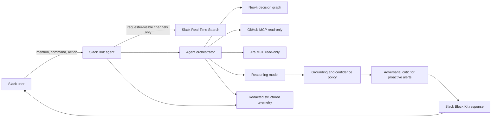
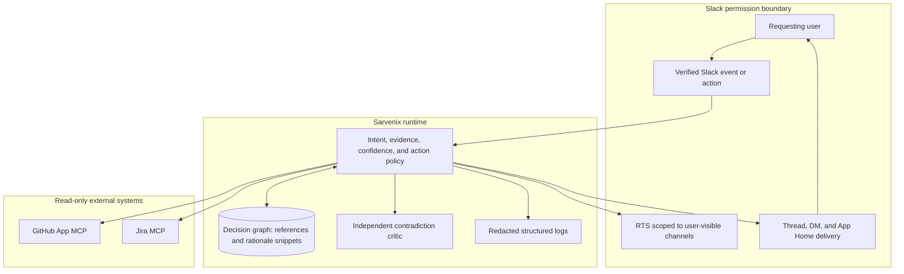

# Sarvenix — Judge Architecture

## Ten-second system view

## Trust boundaries

## Request lifecycle

1. Slack verifies the event signature before Bolt dispatches the handler.
2. Sarvenix derives the requester's accessible channels and scopes RTS to those channel IDs.
3. Retrieval discovers live Slack evidence and explicit Jira/GitHub references.
4. Read-only MCP clients retrieve canonical external evidence with bounded retries and actionable errors.
5. Neo4j contributes provenance and decision relationships, not unrestricted full-message storage.
6. The synthesis model treats retrieved content as untrusted data and may only make supported claims.
7. Confidence reflects source coverage and agreement; missing sources are disclosed.
8. Proactive candidates pass a separate skeptical critic and channel rate limit.
9. Slack renders concise Block Kit output with exact source links and human controls.
10. Resolution changes decision-graph state only after explicit user confirmation; external systems remain unchanged.

## Architectural differentiator

A conventional RAG bot retrieves similar text. Sarvenix combines live retrieval with a persistent decision graph, allowing it to answer not only “what was said?” but “which decision superseded which, what evidence resolved it, who owns it, and does today’s proposal conflict with that history?”

## Current implementation proof

- Slack orchestration and actions: `apps/slack-app/src/index.ts`
- Permission-scoped Ask pipeline: `apps/slack-app/src/modes/ask-mode/index.ts`
- Live external normalization: `apps/slack-app/src/modes/ask-mode/evidence-resolver.ts`
- Grounding rules: `apps/slack-app/src/modes/ask-mode/synthesis.ts`
- Proactive verification: `apps/slack-app/src/modes/serve-mode/**`
- Human resolution: `packages/knowledge-graph/src/client.ts`
- Slack presentation: `apps/slack-app/src/delivery/block-kit-formatters.ts`
- Redacted telemetry: `apps/slack-app/src/lib/logger.ts`
